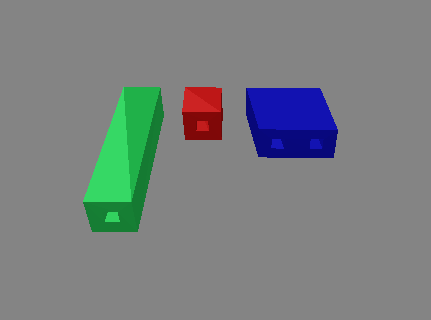

# CAD建模 2022

实现了5个基本欧拉操作（msfv，mev，mef，kemr，kfmrh），并且实现了扫掠操作构建物体。



红色物体为手动构建，绿色和蓝色物体为扫掠操作生成，绿色物体有一个通孔，蓝色物体有两个通孔。


使用了polypartition对多边形进行三角化，如果多边形的点不在同一平面上，会用最小二乘对多边形上的点进行平面拟合，并把多边形上的点投影到这一平面上，再进行多边形三角化，因此某些情况下三角化会存在问题。如果多边形的点都在同一平面上则可以正常使用。


#### 如何使用

项目的部分依赖已在./support文件夹中，并且已经在vs项目中配置好了，但不包括opengl，glfw和freeglut，因此推荐使用vcpkg安装。安装步骤如下：

1. 一台window系统电脑，vs2015或者更高版本

2. 安装vcpkg，参考https://vcpkg.io/en/getting-started.html

3. ```shell
   vcpkg install opengl:x86-windows
   vcpkg install freeglut:x86-windows
   vcpkg install soil:x86-windows
   vcpkg install glew:x86-windows
   vcpkg integrate install
   ```
   
4. 打开CAGD.sln，点击运行。

